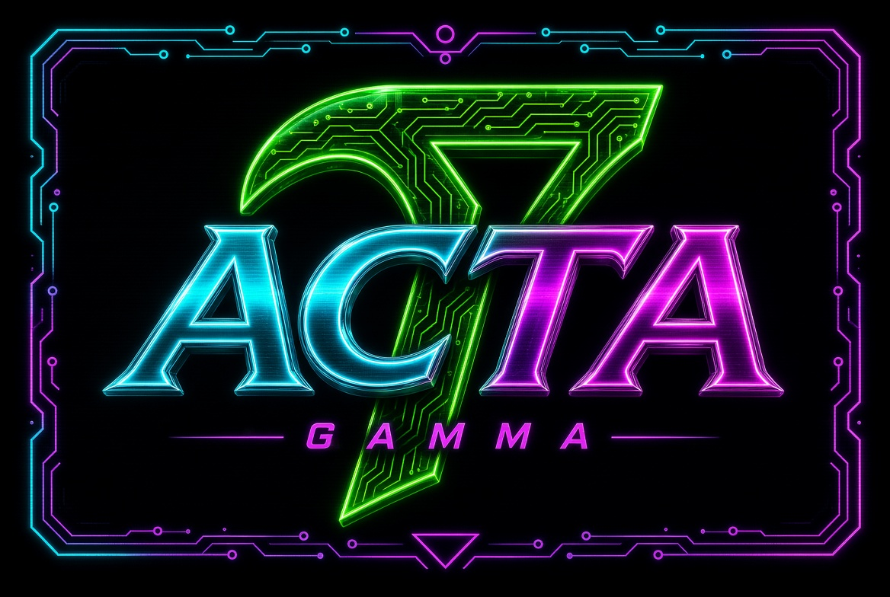

# ACTA Gamma



**LLMs as actions, not agents.**

A small runner that makes one LLM call and records the result — each execution is stateless and one-shot; the SQLite file is a versioned, auditable store behind it. This is not an agent framework. The project is an early prototype / POC — full detail in [`docs/status.md`](docs/status.md).

> **You (or your program) decide what happens. The runner makes one LLM call and records the outcome. The LLM only does the work it's asked to do.**

The C components build with plain `make` on Windows (MinGW/MSYS2), Linux (gcc/clang), and macOS (Xcode clang); the Qt 6 GUI additionally needs `qmake6` (setup: [`docs/building.md`](docs/building.md)).

**You need:** a C compiler (gcc/clang), SQLite, curl, cJSON (Qt 6 only for the optional GUI), and a running llama.cpp `llama-server` in router mode serving at least one GGUF model — exact commands in [Quick start](#quick-start). Everything else is in this repo.

## Quick start

Three steps before the example below:

1. **Install dependencies** — SQLite, curl, cJSON (plus Qt 6 for the GUI): one command block per platform in [`docs/building.md`](docs/building.md).
2. **Build** — from the repo root: `make all` (add `make gui` if you want the desktop app — it is optional and not part of `make all`), or per-component `make`; `make test` runs all C test suites.
3. **Start the backend** — a llama.cpp `llama-server` in **router mode** (launched **without** `-m`: every GGUF in `--models-dir` becomes a served model and each request is routed to the matching one):

   ```sh
   llama-server --models-dir models -c 2048
   ```

   This serves every GGUF in `models/` at `http://127.0.0.1:8080` — the llama.cpp router, not a generic OpenAI endpoint (full contract: [`docs/llamacpp_server_contract.md`](docs/llamacpp_server_contract.md) §1). One model is fine — a small starter: `huggingface-cli download Qwen/Qwen2.5-0.5B-Instruct-GGUF --include "*q4_k_m.gguf" --local-dir models/` (if you don't have llama.cpp yet, [`docs/building.md`](docs/building.md) covers install/build). The `-c 2048` above is a **demo value** — it is the backend's *token* context window; set it to match your model.

   Before any run you can verify the backend and a model **without consuming tokens**: `acta_runner check <model-record-id>` does the two token-free preflight calls (`GET /health`, `GET /v1/models`) and reports `ok` / the served `max_context`, or a distinct verdict (`model still loading`, `server unreachable`, `model not served`, `catalog unreachable`) — no execution row, no DB write. `run` performs the same preflight automatically before the claim. Full spec: [`docs/runner_contract.md`](docs/runner_contract.md), "check action".

## Minimal end-to-end example

Against the running `llama-server` router from the quick start (fresh `acta.db` — by default the platform app-data location, see [Environment variables](#environment-variables-and-the-per-machine-config-file); so every id is `1`).

**Fresh databases need the schema first.** `acta_cli`/`acta_runner` never create the schema themselves — run `acta_cli db init` once (the GUI applies the same schema on first launch); afterwards, schema changes are migrated in place by `acta_cli db migrate`. The migration mechanics, the version ledger, and the fail-closed behavior for foreign or partially migrated files are in [`docs/DBDesign.md`](docs/DBDesign.md). A fresh file without the schema fails with `no such table`.

```sh
# 1. Register the model
# ("backend" is a protocol family: "openai" = OpenAI-compatible HTTP, served here by
#  the llama-server router — currently the only value; model_identifier = the GGUF
#  file's name in your --models-dir, WITHOUT the .gguf extension — verify with GET /v1/models)
acta_cli model create --json '{"name":"llama-local","backend":"openai","base_url":"http://127.0.0.1:8080","model_identifier":"qwen3-8b"}'

# 2. Create a versioned skill (prompt template + optional output_schema —
#    only a subset of JSON Schema keywords is enforced; see the note below)
acta_cli skill create --json '{"name":"sentiment","prompt_template":"Classify the sentiment of the input. Reply with JSON: {\"label\": \"positive\"|\"negative\", \"confidence\": number}","output_schema":{"type":"object","required":["label","confidence"],"properties":{"label":{"type":"string"},"confidence":{"type":"number"}}}}'

# 3. Create an immutable context (the input snapshot; --content_file <path> for large
#    inputs; type is a free-form string — filter later with `context list --type <T>`)
acta_cli context create --json '{"type":"text","content":"The build system shipped on time and the release went smoothly."}'

# 4. Create an execution binding context + skill revision + model revision
acta_cli exec create --json '{"context_id":1,"skill_revision_id":1,"model_revision_id":1}'

# 5. Provide the API key: set the environment variable, or add an "api_key" key to
#    ACTA_Gamma.conf (see above). For a keyless localhost llama-server, an empty value
#    is intentional — it just means no Authorization header is sent.
export OPENAI_API_KEY=""

# 6. Optional: verify the backend and model before the run, without consuming
#    tokens (no execution row, no DB write; exit 0 on ok)
acta_runner check 1

# 7. Run it (blocks until the execution reaches a terminal state; exit 0 on success,
#    non-zero on failure; hard per-call HTTP timeout: --timeout, default 600 s)
acta_runner run 1

# 8. Inspect the result and the audit trail
acta_cli exec get 1
acta_cli log list 1
```

> **`output_schema` note:** the validator enforces only `type`, `required`, `properties`, and `items` — other JSON Schema keywords (`enum`, `pattern`, `minimum`, …) are **not** enforced, and extra fields in the response are allowed. It checks structure, not semantics — a schema-valid but wrong (or injected) response still passes, so downstream consumers must validate the content themselves. Omit `output_schema` for free-text outputs.

What the output looks like (abbreviated — real timestamps, and a full `raw_response`, in practice):

```sh
$ acta_cli exec get 1
{"id":1,"context_id":1,"skill_revision_id":1,"model_revision_id":1,
 "status":"completed","error":null,
 "raw_response":"{\"label\": \"positive\", \"confidence\": 0.9}",
 "result":"{\"label\": \"positive\", \"confidence\": 0.9}",
 "created_at":"2026-07-10T09:30:01","started_at":"2026-07-10T09:30:02",
 "completed_at":"2026-07-10T09:30:03","parent_execution_id":null,"deleted_at":null}

$ acta_cli log list 1
[
 {"id":1,"execution_id":1,"level":"info","event":"execution_started","created_at":"…"},
 {"id":2,"execution_id":1,"level":"info","event":"context_loaded","created_at":"…"},
 {"id":3,"execution_id":1,"level":"info","event":"prompt_resolved","created_at":"…"},
 {"id":4,"execution_id":1,"level":"info","event":"preflight_passed","created_at":"…"},
 {"id":5,"execution_id":1,"level":"info","event":"llm_request","created_at":"…"},
 {"id":6,"execution_id":1,"level":"info","event":"llm_response","created_at":"…"},
 {"id":7,"execution_id":1,"level":"info","event":"execution_completed","created_at":"…"}
]
```

`raw_response` is the model's text verbatim; `result` is the recorded, schema-checked output; the log is the phase timeline. If the response does not match the skill's `output_schema`, the execution is `failed` with a `validation_failed` log row — there is no "completed with a flag" mode. `parent_execution_id` links a replay to the execution it replays (optional on `exec create`).

### Recovery and stale execution handling

A failed backend call (server down, connection error, or `--timeout` exceeded) leaves the execution in `failed` with the error recorded in `error`; a clean exit (Ctrl+C / SIGTERM) while `running` does the same, with the death marker `runner process exited during execution`. Recovery is `acta_cli exec reset <id>` (`failed → pending`) → `acta_runner run <id>` again (or the GUI Retry button, which does both). A hard kill (SIGKILL, power loss) leaves the row orphaned in `running` — `acta_runner sweep --stale-seconds N` fails such rows; pick N larger than your longest legitimate run in flight (e.g. `--timeout 600` → `--stale-seconds 650` or more). Caveat: sweep judges staleness by last activity, not process liveness, and nothing runs it for you. Full semantics: [`docs/runner_contract.md`](docs/runner_contract.md), decision 6; the automatic pre-claim preflight and the manual `check` triage are in [Quick start](#quick-start).

For worked examples against an *existing* database — exploring the DB, revising skills, replaying runs, and running five versioned skills over the same context ([`docs/examples/multi-persona-review.md`](docs/examples/multi-persona-review.md)) — see the tutorial index [`docs/examples/`](docs/examples/README.md).

## What is ACTA Gamma?

ACTA Gamma treats an LLM as a single controlled action in a larger deterministic flow:

```text
Context + Skill + Model
              │
              ▼
         One LLM Call
              │
              ▼
         Observation
```

**Observation** — the LLM's output for this execution, recorded verbatim as the execution's `raw_response`.

The workflow is: register a model, create a skill (a versioned prompt), create a context (the input), create an execution binding them, run it, read the result — the commands in the [Minimal end-to-end example](#minimal-end-to-end-example).

**Core ideas:** one-shot stateless executions, versioned skills, immutable contexts, multi-model, auditable and replayable runs. A replay reproduces the request inputs exactly when it reuses the same context, skill revision, and model revision — that is **input determinism, not output determinism** (["Replay caveat"](docs/PointOfView.md); worked example: [`docs/examples/replay.md`](docs/examples/replay.md)). Suitable for review, analysis, classification, extraction, auditing, and similar tasks.

Terms used throughout: a **skill** is a versioned prompt template with an optional output schema — not a tool, function, or agent capability; a **context** is a named, immutable snapshot of input data — not the model's prompt window; a **revision** is an immutable snapshot of a skill's or model's fields, created automatically whenever the parent is created or edited — an execution is always bound to a specific revision, not to the mutable parent.

The runner drives the execution: the LLM does not orchestrate itself, maintain state, delegate work, or decide what happens next. ACTA Gamma is deliberately not an agent framework — at its core it is a runner over an OpenAI-compatible endpoint plus a SQLite audit log. Full point of view: [`docs/PointOfView.md`](docs/PointOfView.md).

## What it does — and deliberately does not

| Does | Deliberately does **not** (on purpose) |
|---|---|
| Runs **one** versioned, replayable, auditable LLM action against an immutable context | Not an agent: no self-orchestration, no conversational state, no delegation, no workflow composition between skills (a higher-level program chains the executions — [`PointOfView.md`](docs/PointOfView.md)) |
| Versioned skills & models; immutable revision snapshots; immutable contexts | No automatic retries (retry is manual: `exec reset` / GUI Retry) and no streaming responses — product decisions ([`status.md`](docs/status.md)) |
| Standalone runner + GUI (Run/Cancel), soft-delete lifecycle, stale-execution `sweep`, atomic DB snapshot (`acta_cli db backup --to <path>`) | No users, permissions, queues, vector DBs, datasets — one private local SQLite file, no server process ([`DBDesign.md`](docs/DBDesign.md)); no "one skill over N contexts" batch: that is N `exec create` + N `run` commands looped by your script (`acta_runner run --pending [--max N]` only loops *already-created* rows); no hard delete / purge; no prompt-injection defense — the context reaches the model verbatim (see [How a run is assembled](#how-a-run-is-assembled)) |
| Multi-model via a llama.cpp `llama-server` router — the only supported backend (see [Implementation](#implementation)) | No server manager mode — the backend is user-launched and user-managed ([`runner_contract.md`](docs/runner_contract.md)) |

## Revisions, executions, and soft delete

The short version of the lifecycle:

- **Revisions.** Creating, updating, or soft-deleting a skill or model parent auto-snapshots a new immutable revision row via a DB trigger (the fields each revision captures: [`docs/DBDesign.md`](docs/DBDesign.md)); no `active`/`current` flag — the latest revision is the current one, and editing *creates, not modifies*: existing executions keep pointing at the revision they were bound to. Skill/model folders are optional list-display groupings only.
- **Binding & replay.** An execution binds to explicit `skill_revision_id` and `model_revision_id`, and its user message is exactly `context.content` — a replay (a second `exec create` with the same three ids, optionally linked via `--parent_execution_id`) resends byte-identical request inputs.
- **States.** `pending → running → completed`, with `failed` (manual reset via `exec reset`) and `cancelled` (from `pending` or `running`) — full state machine: [`docs/cli_spec.md`](docs/cli_spec.md), "exec" notes.
- **Concurrency.** The claim is atomic (`start()` is a single conditional `UPDATE … WHERE id=? AND status='pending'`); single-writer by design — concurrent readers are fine, simultaneous *writers* on the same file are **not supported** (the `busy_timeout` constant, the exact `SQLITE_BUSY` diagnostic, and the WAL details: [`docs/DBDesign.md`](docs/DBDesign.md)).
- **Soft delete.** Rows are never hard-deleted: `delete` sets a `deleted_at` timestamp, `restore` clears it, listers are live-only by default (`--include_deleted` / `--deleted` to opt back in); a new DB file is the clean-state path.

The full treatment — triggers, the state machine, soft-delete rules, and durability/backup guidance — is in [`docs/DBDesign.md`](docs/DBDesign.md); worked examples: [`docs/examples/create-and-revise.md`](docs/examples/create-and-revise.md) (revision snapshots) and [`docs/examples/playground.md`](docs/examples/playground.md) (soft-delete tour, no backend needed).

## How a run is assembled

The runner builds the chat call from the bound revisions: `system` = the skill's `prompt_template`, `user` = `context.content` — there is no per-execution prompt field, and an empty context content fails at preflight, before any backend call. Preflight enforces a deterministic `max_chars` guard (default 100,000, configurable) on the **UTF-8 byte length** of the two strings — a coarse pre-check, not a token count: the backend's own context window (the router's `-c`, in tokens) is the separate, final constraint, and overflow there surfaces as a backend error. Every phase writes one `execution_log` row, and `prompt_resolved` carries the exact prompt that was sent — the audit trail is self-describing. There is no prompt-injection defense: the context reaches the model verbatim, and `output_schema` validation checks the response's *structure*, not its intent — the operator is responsible for vetting untrusted input. Full pipeline (claim → resolve → preflight → call → validate → record), the `max_chars` spec, and the backend contract: [`docs/runner_contract.md`](docs/runner_contract.md); the llama.cpp router surface: [`docs/llamacpp_server_contract.md`](docs/llamacpp_server_contract.md); the prompt-injection discussion: [`docs/PointOfView.md`](docs/PointOfView.md).

## Environment variables and the per-machine config file

* **`OPENAI_API_KEY`** — the API key for the backend's HTTP calls (`acta_runner` and `acta_gui` use it identically). Resolution: `$OPENAI_API_KEY` (if set — even to the empty string, which is enough for a keyless localhost server) → the config file's `"api_key"` key. No CLI flag; the key is never stored in the database; a key in neither source → the run does not start, an empty key → no `Authorization` header. A set environment variable (even empty) **shadows** the config file's `"api_key"` — a stray `export OPENAI_API_KEY=` in your shell profile disables a stored key — and the binaries print a one-line warning when that happens. Full policy (precedence, warning text, fail-closed config handling): [`docs/runner_contract.md`](docs/runner_contract.md), decision 4.
* **`ACTA_DB`** — database path for `acta_cli` / `acta_runner` when `--db` is not given. Resolution: `--db` → `$ACTA_DB` → the config file's `"db"` → the **same** app-data file as the GUI (`%APPDATA%\ACTA_Gamma\acta.db` on Windows, `~/.local/share/ACTA_Gamma/acta.db` on Linux, `$XDG_DATA_HOME\ACTA_Gamma/acta.db` if set) → `./acta.db` as a last resort. The GUI does **not** read `--db` or `$ACTA_DB` (its *Choose database file* dialog covers non-default setups). Full contract: [`docs/cli_spec.md`](docs/cli_spec.md).
* **`ACTA_Gamma.conf`** — the per-machine config file: a flat JSON object in the same app-data directory as the default DB file, with at most the four keys below; all three binaries read it through the same helper, and a malformed file or unknown key is a fail-closed hard error. It may hold an `api_key` at rest — treat it as sensitive: on POSIX a file not user-only readable (`0600`) is refused; on Windows the mode bits are meaningless (a warning is printed and the file is read anyway) — **on a shared Windows machine, do not store an `api_key` in the file; set `$OPENAI_API_KEY` instead**.

  | Key | Type | Meaning |
  |---|---|---|
  | `"api_key"` | string | key fallback for `$OPENAI_API_KEY` |
  | `"db"` | string | database path step |
  | `"max_chars"` | positive integer | max total prompt size in **UTF-8 bytes** (`skill.prompt_template` + `context.content`); default 100,000 |
  | `"timeout"` | positive integer, seconds | default per-call HTTP timeout; default 600 s (the `--timeout` flag still wins per run) |

## Implementation

The implementation is C/C++ on top of SQLite:

| Component | Language | Description |
|---|---|---|
| `acta_db/` | C11 | SQLite persistence library (`libacta_db`) — skills, skill folders, skill revisions, models, model folders, model revisions, contexts, executions, execution logs ([schema design: `docs/DBDesign.md`](docs/DBDesign.md)) |
| `acta_cli/` | C11 | Command-line client (`acta_cli`) over `acta_db` (uses cJSON for output) |
| `acta_runner/` | C11 | Standalone LLM execution runner (`acta_runner`) — drives pending executions against the model's OpenAI-compatible backend, with `execution_log` phase rows (uses curl + cJSON) |
| `acta_gui/` | C++ / Qt 6 (Core, Widgets) | Desktop GUI: manage skills, models, contexts, review executions, and run them. The in-app **Run** button runs the runner's pipeline in-process (hard build constraint: [`docs/building.md`](docs/building.md), "GUI–runner source coupling"); while a run is in flight **Run** becomes **Cancel** — cancel stops the *recording*, not the compute ([`docs/runner_contract.md`](docs/runner_contract.md), decision 1) |

The backend is a llama.cpp `llama-server` running in **router mode** (launched without `-m`, with `--models-dir` pointing at local GGUF files) — it is the **only** supported backend. llama.cpp **0.5.0** is the tested baseline and a hard requirement (the runner does no version negotiation); models are loaded when the server starts — **restart the server after adding or removing model files**. The pipeline talks to it through the OpenAI-compatible HTTP surface, but that surface is the interface, not a portability promise; ACTA Gamma is not a generic OpenAI client. The backend is assumed to be a **local, unauthenticated, plain-HTTP** endpoint — do not point `base_url` at a remote host; the API key (if any) travels in cleartext. The full backend contract (version pin, the OpenAI-compatible surface, error shapes): [`docs/llamacpp_server_contract.md`](docs/llamacpp_server_contract.md).

### Building

See [`docs/building.md`](docs/building.md) for dependencies, platform-specific setup (MinGW/MSYS2, Linux, macOS), the per-component `make` steps, and the top-level wrapper (`make all`, `make test`).

## Commands at a glance

The full per-action flag tables and wire format are in [`docs/cli_spec.md`](docs/cli_spec.md); this is just orientation:

| Command | What it does |
|---|---|
| `acta_cli db init` | apply the canonical schema to a fresh DB file (once, before anything else) |
| `acta_cli db migrate` | apply pending versioned schema migrations in place |
| `acta_cli db backup --to <path>` | atomic snapshot of the open database |
| `acta_cli model create` | register a model (backend, `base_url`, `model_identifier`) |
| `acta_cli skill create` | create a versioned prompt template + optional `output_schema` |
| `acta_cli context create` | create the immutable input snapshot |
| `acta_cli exec create` | bind context + skill revision + model revision into a `pending` execution |
| `acta_runner check <model-id>` | token-free backend + model health check (no execution row, no DB write) |
| `acta_runner run <id>` / `run --pending` | claim, preflight, one LLM call, record result + `execution_log` |
| `acta_cli exec reset <id>` | `failed → pending` so the execution can be rerun |
| `acta_runner sweep --stale-seconds N` | fail stale `running` rows left behind by a dead process |
| `acta_cli exec get <id>` / `log list <id>` | read the recorded result, raw response, and phase log |

## CLI ergonomics

All three binaries support `--version` and `--help`. The CLI offers file in/out (`--content_file`, `--out`, `--raw_out`), NDJSON `--stream`, output shaping (`--fields`, `--no_nulls`, `--table`, `--count`, `--id_only`), light-projection listers (`--full` for the high-volume blob fields), and the machine-readable `--tools` JSON schema. It takes no user-supplied SQL: `db init` applies the canonical embedded schema to a fresh file (already schema'd file → no-op; partial/foreign file → fail closed, exit 4). Full wire format, per-action flag tables, and error contracts: [`docs/cli_spec.md`](docs/cli_spec.md).

Components and their reference docs:

| Component | Contract / design doc |
|---|---|
| `acta_db/` | [`docs/DBDesign.md`](docs/DBDesign.md) — schema, triggers, state machine, soft-delete rules |
| `acta_cli/` | [`docs/cli_spec.md`](docs/cli_spec.md) — wire format, per-action flags, error contracts |
| `acta_runner/` | [`docs/runner_contract.md`](docs/runner_contract.md) — pipeline; [`docs/llamacpp_server_contract.md`](docs/llamacpp_server_contract.md) — backend contract |
| `acta_gui/` | build in [`docs/building.md`](docs/building.md); design decisions in [`docs/status.md`](docs/status.md) |
| project-wide | [`docs/PointOfView.md`](docs/PointOfView.md) — philosophy and non-goals |

## Your first session in the GUI

The GUI is a convenience layer for humans: paste inputs, watch a run, read results without terminal JSON. Programs and scripted use should use the CLI (`acta_cli` + `acta_runner`), which is the complete surface; every GUI operation has a CLI equivalent.

Once the backend is running ([Quick start](#quick-start)), launch `acta_gui` (built with `make gui` — the GUI is optional and not part of `make all`). On first start it creates the `acta.db` database file for you in the platform app-data directory (the same file `acta_cli` / `acta_runner` resolve to out of the box — see [Environment variables and the per-machine config file](#environment-variables-and-the-per-machine-config-file)); its *Choose database file* dialog remains for non-default setups. Then:

1. **Model** — Models panel → *New…* → a name, the backend (`openai`), the router's address, and the model id (the GGUF file's name in your `--models-dir` folder, without the `.gguf` extension).
2. **Skill** — Skills panel → *New…* → a name and the prompt template — the instruction describing the action.
3. **Context** — Contexts panel → *New…* → a type, and paste the content (a document, a code file, a log…).
4. **Execution** — Executions panel → *New…* → pick the context, the skill and the model, then press **Run**.
5. **Watch it** — the row moves `pending → running → completed` (or `failed`). While it runs, **Run** becomes **Cancel**. **Log** shows the phase timeline (including the resolved prompt), **Details** shows the raw response and the result; **Retry** re-runs a failed execution.

## Current status

Early prototype / POC: the core pipeline is complete (entity model and persistence, versioned skills/models, execution lifecycle with `execution_log`, the standalone runner, the GUI, soft-delete/restore, `sweep`, and the `db backup --to` atomic snapshot); the project is at an early productization stage. Retry is manual by design (a failed execution is reset explicitly with `exec reset` or the GUI Retry button), and streaming responses are out of scope by design — an execution is a single, non-interactive call. These are product decisions, not missing features. Full detail in [`docs/status.md`](docs/status.md); the issue log ([`docs/known_issues.md`](docs/known_issues.md)) records the issues found and fixed so far (all currently closed).

## License

BSD Zero Clause License (BSD-0-Clause).

## Third-party code

The SHA-256 implementation in `acta_cli/src/sha256.c` is taken from
[Brad Conte's crypto-algorithms](https://github.com/B-Con/crypto-algorithms/tree/master)
(`sha256.c`) — public domain, free of any restrictions — and is used for
the `context create` content hash (the context's `hash` field: SHA-256 of
the content, lowercase hex, when the hash is omitted).

Two external libraries are linked at build time (not vendored — point the
Makefile overrides `CJSON_DIR` / `CJSON_LIB` / `CURL_INC` / `CURL_LIB` at a
custom build if needed; see [`docs/building.md`](docs/building.md)):

- **cJSON** ([DaveGamble/cJSON](https://github.com/DaveGamble/cJSON), MIT) —
  the CLI's JSON input/output layer, the config-file parser, and the
  runner's request/response handling (the GUI compiles `run.c` and reuses it).
- **libcurl** ([curl](https://curl.se/), "curl" license with an explicit
  patent grant) — the runner's HTTP calls
  (`acta_runner/src/backend.c`; the GUI compiles `backend.c` and reuses it).
